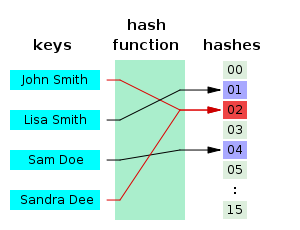

## 해시 
#### 공부 날짜: 2024/06/21

<br><br>
### 해시 함수란?
- 데이터의 효율적 관리를 목적으로 임의의 길이의 데이터를 **고정된 길이의 데이터**로 매핑하는 함수다. 
- 이때 매핑 전 원래 데이터 값을 키(key), 매핑 후 데이터 값을 해시값(hash value),매핑하는 과정 자체를 해싱(hashing)이라고 한다.


<br>

### 해시 충돌이란?
- 두 개 이상의 다른 키가 해시 함수에 의해 **동일한 해시값을 내는** 것을 '해시 충돌'이라고 한다.

- 위의 예시에서 John Smith와 Sandra Dee라는 다른 키가 해시 함수에 의해서 동일한 해시값인 02로 매핑되어 '해시충돌'을 일으켰다. 


<br>

### 해시테이블이란?
> 해시함수를 사용해 키를 해시값으로 매핑하고, 이 해시값을 **인덱스(index)로 삼아** 키(key)와 데이터(value)를 저장하는 자료구조를 말한다. 이 때 데이터가 저장되는 곳을 버킷(bucket) 또는 슬롯(slot)이라고 한다. 

<br>

### 해시테이블을 왜쓸까?
1. 적은 리소스로 많은 데이터를 효율적으로 관리가 가능하다.

예) 해시함수로 하드디스크에 존재하는 무한에 가까운 데이터(키)들을 유한한 개수의 해시값으로 매핑함으로써 작은 크기의 캐시 메모리로도 프로세스 관리가 가능하다.

2. index를 사용함으로써 모든 데이터를 살피지 않아도 검색과 삽입/삭제를 빠르게 수행할 수 있다. 

3. 데이터 엑세스(삽입,삭제,탐색)시 계산 복잡성 O(1)을 지향한다.


<br>

### 해시 충돌 문제를 어떻게 해결할까?
1. 체이닝 : 해시 테이블의 각 인덱스에 링크드 리스트를 사용하는 방법. 충돌이 발생하면 동일한 인덱스에 여러 개의 (key,value) 쌍을 저장할 수 있다. 하지만 추가적인 메모리 사용이 필요하고, 최악의 경우 검색 시간 복잡도가 O(n)까지 증가한다.
2. 오픈 어드레싱 : 해시 함수로 얻은 주소가 아닌 **다른 주소**(다른 슬롯)에 데이터를 저장할 수 있도록 허용한다.
   1. 선형 탐사 -> 충돌 발생시 일정한 간격을 더해가며 빈 슬롯을 찾는 방법
   2. 이차 탐색 -> 충돌이 발생시 제곱수의 간격으로 빈 슬롯을 찾는 방법 

<br><br>

### 해시 테이블 구현 코드

```java
import java.io.BufferedReader;
import java.io.InputStreamReader;

public class Solution {

    static final int HASH_SIZE = 1000; //해시 테이블의 크기(슬롯 개수)를 정의
    static final int HASH_LEN = 400; //해시 슬롯에서 허용할 수 있는 최대 문자열 수 
    static final int HASH_VAL = 17;//해시 함수 계산 시 사용하는 소수 값

    static int[][] data = new int[HASH_SIZE][HASH_LEN]; //각 해시 슬롯에서 문자열 중복 횟수 저장하는 배열
    static int[] lengh = new int[HASH_SIZE];// 각 해시 슬롯에 저장된 문자열의 개수 저장하는 배열
    static String[][] s_data = new String[HASH_SIZE][HASH_LEN];//각 해시 슬롯에 실제 저장된 문자열을 저장하는 2차원 배열

    public static void main(String[] args) throws Exception {
        BufferedReader br = new BufferedReader(new InputStreamReader(System.in));
        StringBuilder sb = new StringBuilder();
        
        int N = Integer.parseInt(br.readLine());
        
        for(int i = 0; i < N; i++) {
            str = br.readLine();
            
            int key = getHashKey(str);
            int cnt = checking(key);
            
            if(cnt != -1) {//이미 들어왔던 문자열
                sb.append(str).append(cnt).append("\n");
            } else {
                sb.append("OK").append("\n");
            }
            
            System.out.println(sb.toString());
        }
    }
    
    public static int getHashKey(String str) {
        int key = 0;
        
        for(int i = 0; i < str.length(); i++) {
            key = (key * HASH_VAL) + str.charAt(i) + HASH_VAL;
        }
        
        if(key < 0) key = -key; //key값이 음수면 양수로 바꿔주기
        
        return key % HASH_SIZE;
    }
    
    public static int checking(int key) {
        int len = length[key]; //현재 key에 담긴 수 
        
        if(len != 0) {//이미 들어온 적이 있다면
            for(int i = 0; i < len; i++) {
                if(str.equals(s_data[key][i])) {
                    data[key][i]++; //중복횟수 증가 
                    return data[key][i];
                }
            }
        }

        // 들어온 적이 없었으면 해당 key배열에서 문자열을 저장하고 길이 1 늘리기
        s_data[key][length[key]++] = str;

        return -1; // 처음으로 들어가는 경우 -1 리턴
    }
}

```

<br><br>

#### 참고 자료
<https://gyoogle.dev/blog/computer-science/data-structure/Hash.html>
<https://ratsgo.github.io/data%20structure&algorithm/2017/10/25/hash/>