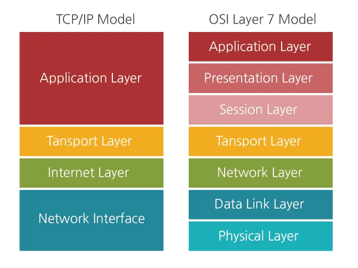
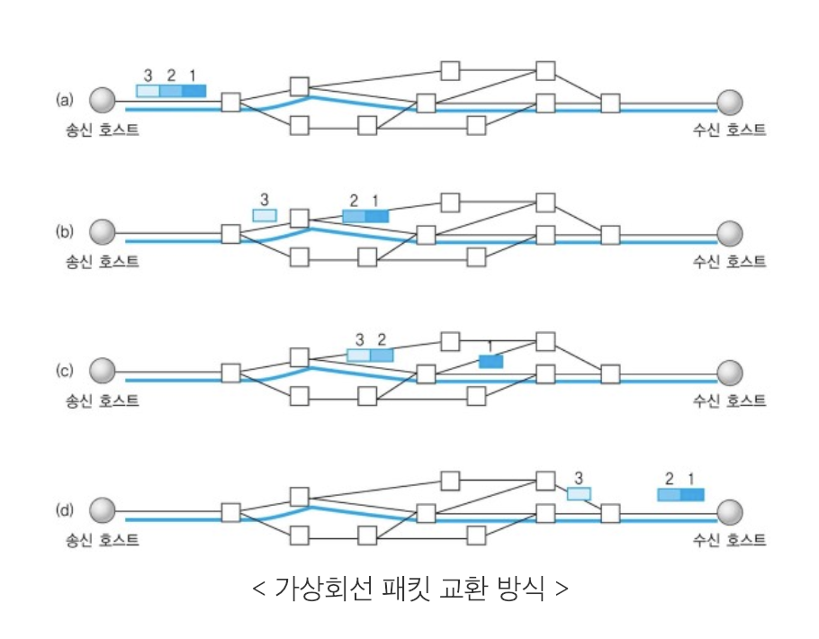
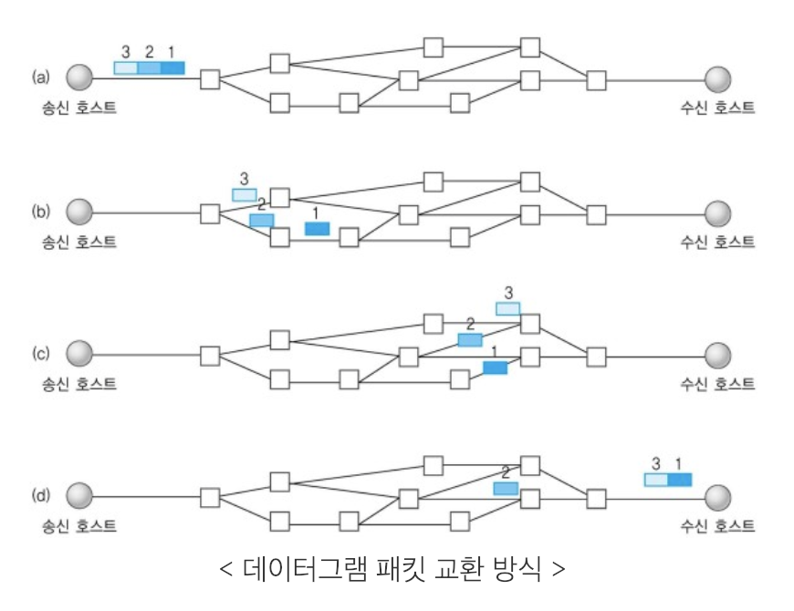
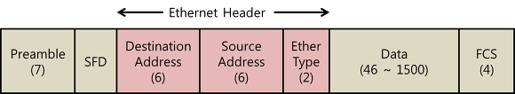
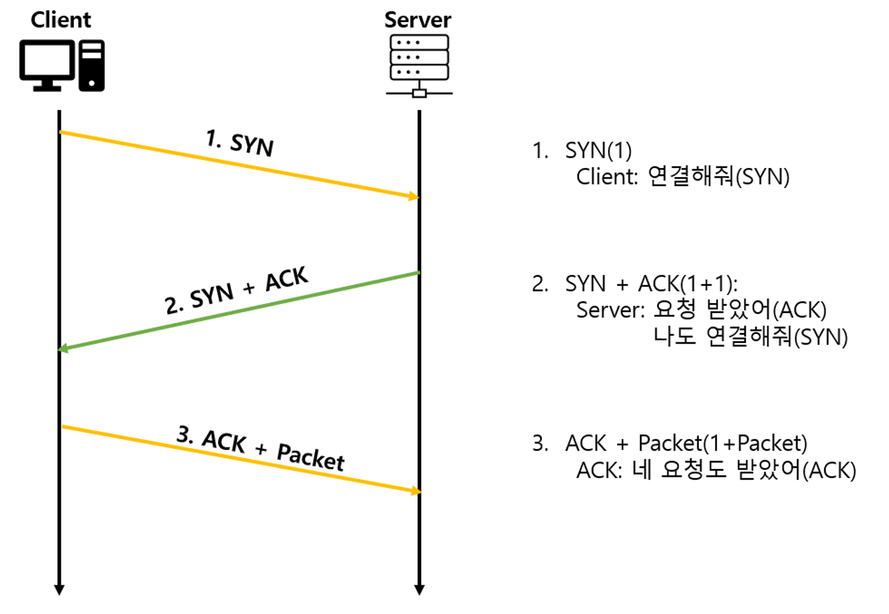
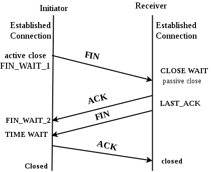
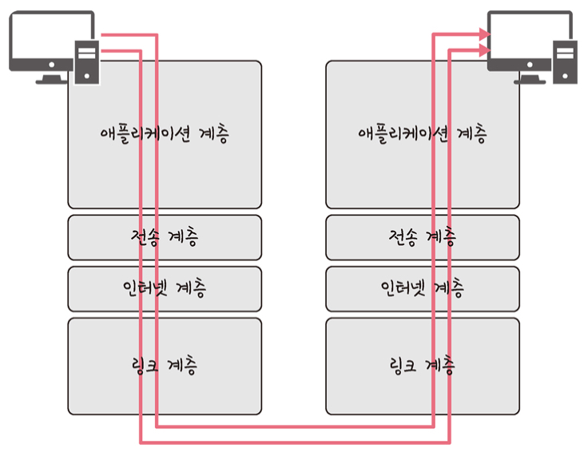
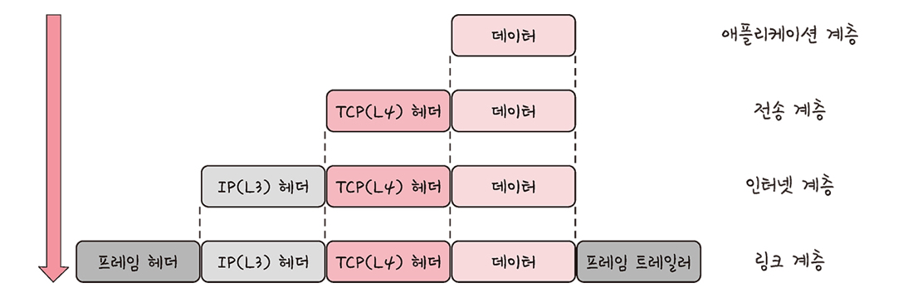
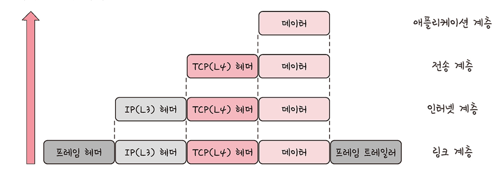

## TCP/IP 4계층 모델
#### 공부 날짜: 2024/07/05

  
### 키워드
- TCP/IP 4계층 모델 
- 애플리케이션 계층,전송 계층,인터넷 계층,네트워크 엑세스 계층
- 가상회선 패킷 교환 방식
- 데이터그램 패킷 교환 방식 
- 이더넷 프레임
- 3-way handshake
- 4-way handshake
- TIME_WAIT
- 캡슐화
- 비캡슐화
- PDU
- 패킷,세그먼트,메시지,비트,프레임

 

---

### TCP/IP 4계층 모델 
> 이 모델은 <u>네트워크에서 사용되는 **통신 프로토콜의 집합**</u>으로, 계층들은 <u>프로토콜의 네트워킹 범위에 따라</u> 4개의 추상화 계층으로 구성된다. 
> 
> 간단히 말해 네트워킹할때 규칙을 계층구조로 나열한 것이다. 

 

 

1. 애플리케이션 계층
    - FTP,HTTP,SSH,SMTP,DNS등 **응용 프로그램이 사용되는** 프로토콜 계층이다. 
      - FTP: 장치와 장치간 파일을 전송하는 데 사용되는 표준 통신 프로토콜
      - SSH: 보안되지 않은 네트워크에서 네트워크 서비스를 안전하게 운영하기 위한 암호화 네트워크 프로토콜
      - HTTP: 웹 사이트를 이용하는 데 쓰는 프로토콜 
      - SMTP: 전자 메일 전송을 위한 인터넷 표준 통신 프로토콜
      - DNS: 도메인 이름과 IP 주소를 매핑해주는 서버 
    - 웹 서비스,이메일 등 **서비스를 실질적으로 사람들에게 제공하는 계층** 

 

2. 전송 계층
   - <u>송신자와 수신자를 연결</u>하는 **통신 서비스를 제공**하며 연결 지향 데이터 스트림 지원, 신뢰성, 흐름 제어를 제공할 수 있다. 
   - 애플리케이션과 인터넷 계층 사이의 데이터가 전달될 때 중계 역할을 한다. 
   - 대표적으로 TCP와 UDP가 있다. 
   - TCP(Transmission Control Protocol)는 **패킷 사이의 순서를 보장**하고, **연결 지향 프로토콜**을 사용해 신뢰성을 구축해 <u>수신 여부 확인</u>한다. (가상회선 패킷 교환 방식)
   - UDP(User Datagram Protocol)는 순서를 보장하지 않고 수신 여부를 확인하지 않으며 <u>단순히 데이터만 준다.</u>(데이터그램 패킷 교환 방식)

 

3. 인터넷 계층
   - 장치로부터 받은 네트워크 패킷을 IP 주소로(지정된 목적지) 전송하기 위해 사용되는 계층이다. 
   - IP,ARP,ICMP 등이 있으며 패킷을 수신해야 할 **상대의 주소를 지정**해 데이터를 전달한다. 
   - 상대방이 제대로 받았는지에 대해 보장하지 않는 **비연결적 특성** 

 

4. 네트워크 엑세스 계층
   - 전선,광섬유,무선 등으로 **실질적으로 데이터를 전달**하며 장치 간에 **신호를 주고 받는 규칙을 정하는 계층**이다. 
   - 이를 물리 계층과/데이터 링크 계층으로 나누기도 한다.
     - 물리 계층은 무선 LAN과 유선 LAN을 통해 0과 1로 이뤄진 데이터를 보내는 계층을 말하고
     - 데이터 링크 계층은 '이더넷 프레임'을 통해 에러 확인, 흐름 제어,접근 제어를 담당하는 계층을 말한다.

  

+ 가상회선 패킷 교환 방식
  + 각 패킷에는 **가상 회선 식별자**가 포함되며 모든 패킷을 전송하면 가상회선이 해제되고 패킷들은 **전송된 순서대로 도착하는 방식**을 말한다. 
  + 데이터를 전송하기 전에 <u>논리적 연결이 설정되는데</u> 이를 가상회선이라고 한다. 

  

+ 데이터그램 패킷 교환 방식
   + 패킷이 독립적으로 이동하며 최적의 경로를 선택한다. 
   + 하나의 메시지에서 분할된 여러 패킷은 **서로 다른 경로로 전송될 수 있으며** 도착한 '순서가 다를 수'있는 방식이다. 

  

+ 이더넷 프레임: 데이터 링크 계층은 이더넷 프레임을 통해 전달받은 데이터의 에러를 검출하고 캡슐화한다.

- Preamble: 이더넷 프레임이 시작임을 알린다. 
- SFD(Start Frame Delimiter): 다음 바이트부터 MAX 주소 필드가 시작됨을 알린다. 
- DMAC,SMAC: 수신,송신 MAC 주소를 말한다. 
- EtherType: 데이터 계층 위의 계층인 IP 프로토콜을 정의한다. 예로 IPv4 또는 IPv6가 된다. 
- Payload: 전달받은 데이터 
- CRC: 에러 확인 비트 

---

### TCP 연결 성립 과정 
> TCP는 신뢰성을 확보할 때 '3-way handshake'라는 작업을 진행한다. 

 

1. SYN 단계: 클라이언트는 서버에 클라이언트의 ISN을 담아 SYN을 보낸다. ISN은 새로운 TCP 연결의 <u>첫 번째 패킷에 할당된</u> 임의의 시퀀스 번호를 말한다.(장치마다 다를 수 있음)

 

2. SYN + ACK 단계: 서버는 클라이언트의 SYN을 수신하고 서버의 ISN을 보내며 승인 번호로 클라이언트 ISN + 1을 보낸다. 

 

3. ACK 단계: 클라이언트는 서버의 ISN + 1한 값인 승인번호를 담아 ACK를 서버에 보낸다 

 

➡️ 3-way handshake는 이렇게 데이터 전송을 위해 **장치간의 안정적인 연결을 설정**하는 데 사용된다.(신뢰성있는 계층)

 

---

### TCP 연결 해제 과정 
> TCP가 연결을 해제할 때는 4-way handshake 과정이 발생한다. 

 

 

1. 먼저 클라이언트가 연결을 닫으려고 할 때 `FIN`으로 설정된 세그먼트를 보낸다. 그리고 글라이언트는 `FIN_WAIT_1` 상태로 돌아가고 서버의 응답을 기다린다. 

 

2. 서버는 클라이언트로 `ACK`라는 승인 세그먼트를 보낸다. 그리고 `CLOSE_WAIT` 상태에 들어간다. 클라이언트가 그 세그먼트를 받으면 `FIN_WAIT_2` 상태에 들어간다. 

 

3. 서버는 2번의 `ACK`를 보내고 일정 시간 이후에 클라이언트에 `FIN` 이라는 세그먼트를 보낸다. 

 

4. 클라이언트는 `TIME_WAIT` 상태가 되고 다시 서버로 `ACK`를 보내서 서버는 `CLOSED` 상태가 된다. 이후 클라이언트는 어느 정도의 시간을 대기한 후 연결이 닫히고 클라이언트와 서버의 **모든 자원의 연결이 해제된다.**

  

🤔 왜 `TIME_WAIT`라는 상태가 있을까? 그냥 연결을 닫으면 되지 왜 일정 시간 뒤에 닫을까?

A. 
1. <u>지연 패킷이 발생할 경우를 대비</u>하기 위해서다. 뒤늦게 패킷이 도달하고 이를 처리하지 못하면 **데이터 무결성 문제**가 발생한다. 
2. 두 장치가 연결이 정상적으로 종료됐는지 확인하기 위해서다. (중간에 패킷 소실 대비)

---

### 계층 간 데이터 송수신 과정

1. 애플리케이션 계층에서 전송 계층으로 보내는 요청 값들이 **캡슐화 과정**을 거쳐 전달
2. 링크 계층을 통해 해당 서버와 통신
3. 해당 서버의 링크 계층으로부터 애플리케이션까지 **비캡슐화** 과정을 거쳐 데이터가 전송된다.

 

- 캡슐화 과정: 상위 계층의 데이터와 헤더를 하위 계층의 데이터 부분에 포함시키고 하위 계층의 헤더를 삽입하는 과정

1. 애플리케이션 계층의 데이터가 전송 계층으로 전달 (**세그먼트** or **데이터그램화**). TCP(L4) 헤더가 붙음
2. 인터넷 계층으로 가면서 IP(L3) 헤더가 붙음(**패킷화**)
3. 네트워크 엑세스 계층으로 전달. 프레임 헤더와 프레임 트레일러가 붙어 **프레임**화됨.

 

- 비캡슐화 과정: 하위 계층에서 상위 계층으로 가며 각 계층의 <u>헤더 부분을 제거하는 과정</u>

1. 캡슐화된 데이터를 클라이언트로부터 받음
2. 네트워크 엑세스 계층부터 타고 올라오며 헤더 부분을 제거한다. 
3. 프레임화 -> 패킷화 -> 세그먼트 -> 메시지화 
4. 최종적으로 사용자에게 애플리케이션 계층의 PDU로 메시지가 전달된다. 

  

---

### PDU(Protocol Data Unit)
> 네트워크의 어떠한 계층에서 어떠한 계층으로 데이터가 전달될 때 **한 덩어리의 단위**를 PDU라고 한다.
> 
> PDU는 제어 관련 정보들이 들어간 **헤더**와 데이터를 의미하는 **페이로드**로 구성되어 있으며, 계층마다 부르는 명칭이 다르다. 

 

- 애플리케이션 계층: 메시지
- 전송 계층: 세그먼트(TCP), 데이터그램(UDP)
- 인터넷 계층: 패킷
- 네트워크 엑세스 계층: 프레임(데이터 링크 계층), 비트(물리 계층)

예를 들어 애플리케이션 계층은 '메시지'기반으로 데이터를 전달한다. 

---

   

#### 참고 자료

[자료1](https://woovictory.github.io/2018/12/28/Network-Packet-Switching-Method/)

[자료2](https://www.linkedin.com/pulse/tcp-4-way-termination-handshake-ibraham-ajazz)

[자료3](https://velog.io/@ash3767/%EC%9D%B4%EB%8D%94%EB%84%B7-%ED%94%84%EB%A0%88%EC%9E%84-%EA%B5%AC%EC%A1%B0)

면접을 위한 CS 전공지식 노트 