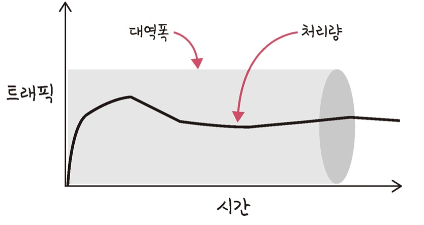
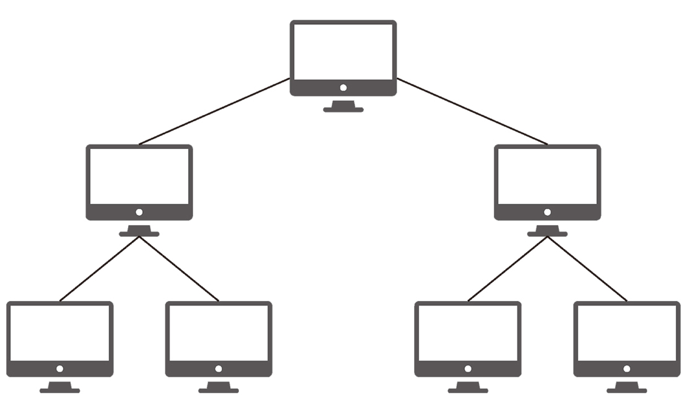
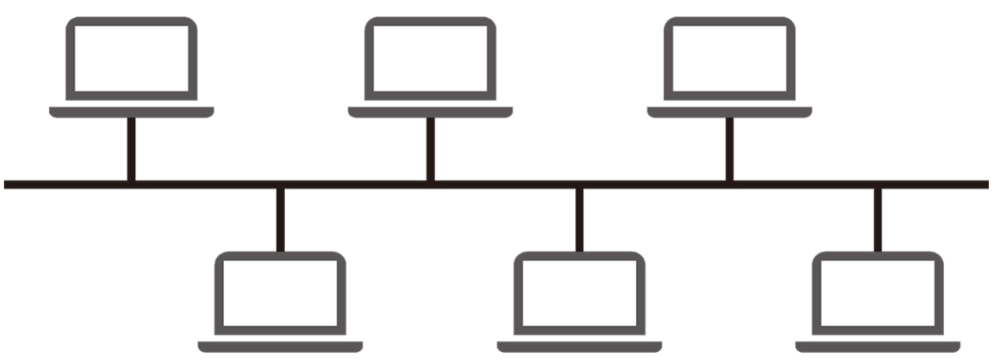
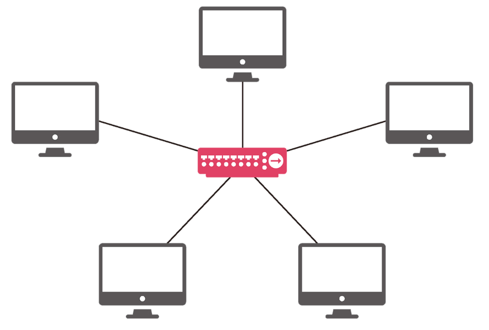
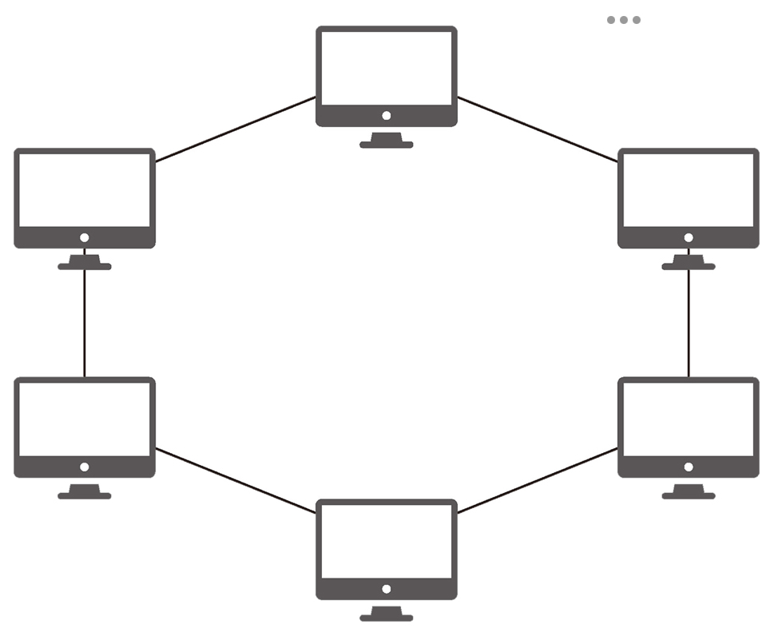
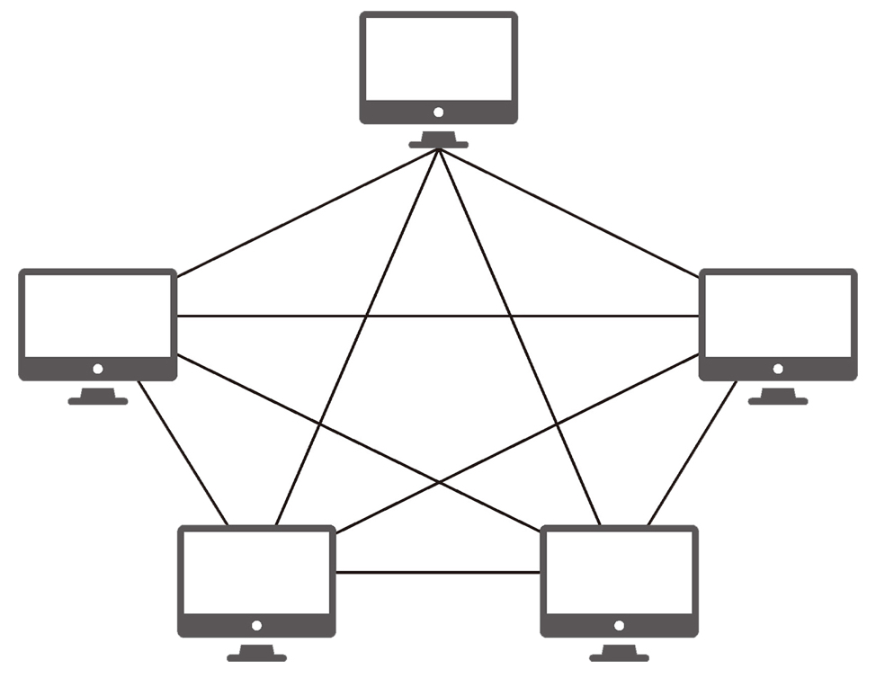
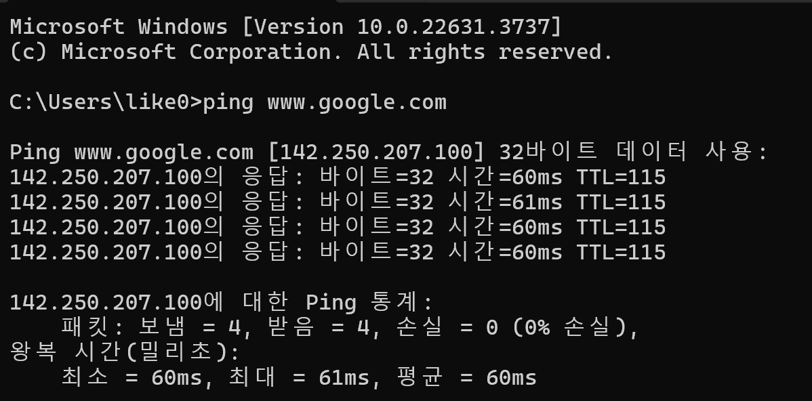
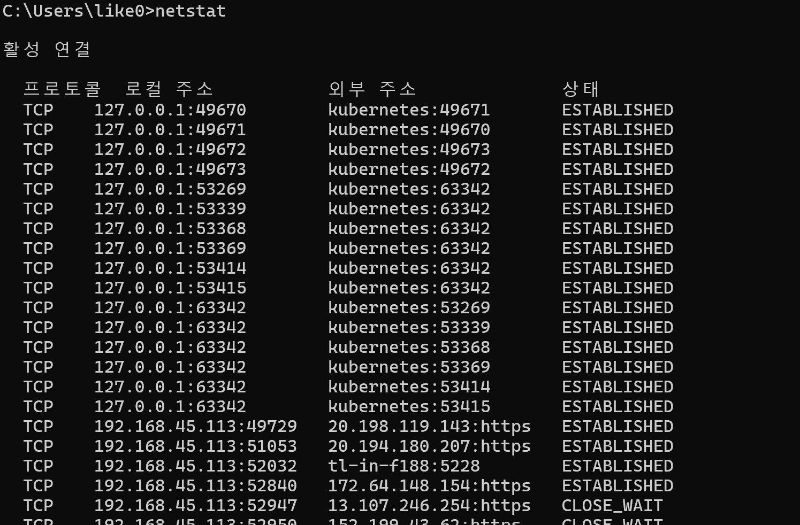
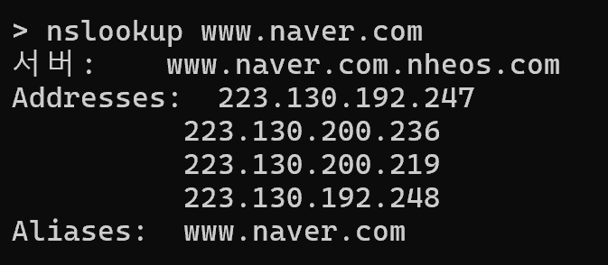
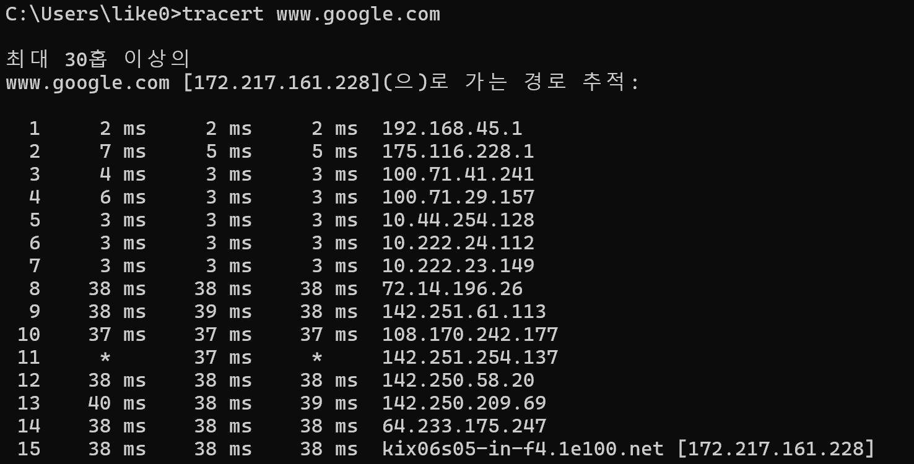

## 네트워크의 기초 
#### 공부 날짜: 2024/07/04

  
### 키워드
- 네트워크 
- 노드와 링크 
- 처리량 
- 지연 시간 
- 네트워크 토폴로지(버스,트리,스타,링,메시)
- 스푸핑 
- 병목현상
- LAN,WAN,MAN
- 네트워크 성능 분석 명령어 
  - netstat
  - ping
  - nslookup
  - tracert 

 

### 네트워크란?
> **관계망**, **통신망**이라고 할 수 있다. 
> 
> 노드(node)와 링크(link)가 서로 **연결**되어 있으며 **리소스를 공유하는 집합**을 의미한다. 
> 
> 여기서 노드란 서버,라우터,스위치 등 네트워크 장치를 의미하고 링크는 유선 또는 무선을 의미한다. 

 

### 처리량과 지연 시간 
좋은 네트워크란 많은 처리량을 처리할 수 있으며 지연 시간이 짧고 장애 빈도가 적으며 좋은 보안을 갖춘 네트워크를 말한다. 

 

- 처리량이란 링크를 통해 전달되는 **단위 시간당 데이터양**을 말한다.

 

- 지연 시간이란 **요청이 처리되는 시간**을 말한다. 어떤 메시지가 두 장치 사이를 왕복하는 데 걸린 시간을 말한다. 
  + 지연 시간은 매체 타입(무선,유선), 패킷 크기, 라우터 패킷 처리 시간에 영향을 받는다. 

 

### 네트워크 토폴로지와 병목 현상 
- 네트워크 토폴로지(network topology)
  + **노드와 링크가 어떻게 배치되어 있는지**에 대한 방식이자 연결 형태를 의미한다. 

1. 트리 토폴로지 (계층형 토볼로지) : 트리 형태로 배치한 네트워크 구성 

- 노드의 추가, 삭제가 쉽다
- 특정 노드에 트래픽이 집중될 때 하위 노드에 영향을 끼칠 수 있다. 

 

2. 버스 토폴로지 : **중앙 통신 회선 하나**에 여러 노드가 연결되어 공유하는 네트워크 구성을 말하며 **근거리 통신망 LAN**에서 사용한다. 

- 설치 비용이 적고 신뢰성이 우수하다. 
- 중앙 통신 회선에 노드를 추가하거나 삭제하기가 쉽다 
- 스푸핑에 취약한 구조다. 
  + 스위칭 기능을 마비시키거나 속여 잘못된 노드에 송신부의 패킷이 오도록 처리하는 것을 말한다. 

 

3. 스타 토폴로지 : 중앙에 있는 노드에 모두 연결된 네트워크 구성을 말한다. 

- 노드를 추가하거나 에러를 탐지하기 쉽다 
- 패킷의 충돌 발생 가능성이 적다. 
- 어떤 노드에 장애가 발생하더라고 쉽게 에러를 발견할 수 있다. 
- 장애 노드가 중앙 노드가 아닐 경우 , 다른 노드에 영향을 끼치는 것이 적다. 
- 중앙 노드에 장애가 발생하면 전체 네트워크를 쓸 수 없다 
- 설치 비용이 고가다

 

4. 링형 토폴로지 : 각각의 노드가 양 옆의 두 노드와 연결해 전체적으로 고리처럼 통신을 구성하는 망 구성 방식이다. 

- 노드 수가 증가되어도 네트워크상의 손실이 거의 없고, 충돌이 발생되는 가능성이 적다. 
- 노드의 고장 발견을 쉽게 찾을 수 있다. 
- 네트워크 구성 변경이 어렵다
- 회선에 장애가 발생하면 전체 네트워크에 영향을 크게 끼친다. 

 

5. 메시 토폴로지 (망형 토폴로지) : 그물망처럼 연결되어 있는 구조 

- 한 단말 장치에 장애가 발생해도 여러 개의 경로가 존재해 네트워크를 계속 사용할 수 있다
- **트래픽도 분산 처리가 가능하다** 
- 노드의 추가가 어렵다 
- 구축 비용과 운용 비용이 고가다. 

 

### 병목 현상(bottleneck)
> 전체 시스템의 성능이나 용량이 <u>하나의 구성요소로 인해 제한을 받는 현상이다. </u>

 

- 토폴로지가 중요한 이유는 **병목 현상을 찾을 때** 중요한 기준이 되기 때문이다. 

 

### 네트워크 분류 
네트워크는 **규모를 기반으로** 분류할 수 있다. 

1. LAN(Local Area Network): 사무실과 개인적으로 소유가능한 규모의 네트워크 
    - 근거리 통신망 
    - 같은 건물이나 캠퍼스 등 **좁은 공간**에서 운영된다. 
    - 전송 속도가 빠르고 혼잡하지 않다. 

2. MAN(Metropolitan Area Network): 서울시 등 시 정도의 규모인 네트워크 
    - 대도시 지역 네트워크를 나타낸다. 
    - 전송속도는 평균이며 LAN보다는 더 많이 혼잡하다. 

3. WAN(Wide Area Network): 세계 규모의 네트워크 
   - 광역 네트워크
   - 국가 또는 대륙 같은 넓은 지역에서 운영된다. 
   - 전송 속도는 낮으며 MAN 보다 더 혼잡하다. 

 

### 네트워크 성능 분석 명령어 

애플리케이션 코드상에는 문제가 없는데 사용자가 서비스로부터 데이터를 가져오지 못하는 상황이 발생되기도 하는데... 이는 **네트워크 병목 현상**일 가능성이 있다. 

 

네트워크 병목 현상의 주된 원인 
1. 네트워크 대역폭 
2. 네트워크 토폴로지 
3. 서버CPU,메모리 사용량 
4. 비효율적인 네트워크 구성 

이때 네트워크 관련 테스트와 네트워크와 무관한 테스트를 통해 '네트워크로부터 발생한 문제점'인 것을 확인하면 네트워크 성능 분석을 해봐야 한다.

1. ping: 네트워크 상태를 확인하려는 대상 노드를 향해 <u>일정 크기의 패킷을 전송하는 명령어</u>
   - ICMP 프로토콜을 통해 동작한다. 
   - ICMP 프로토콜을 지원하지 않거나 차단하는 대상의 경우 ping 테스트 불가 

2. netstat: 접속되어 있는 서비스들의 네트워크 상태를 표시한다. 
   - 네트워크 접속, 라우팅 테이블, 네트워크 프로토콜 등 리스트를 보여준다. 
   - 주로 서비스의 포트가 열려 있는지 확인할 때 쓴다.
   - ESTABLISHED: 연결이 설정됨
   - CLOSE_WAIT: 다른 쪽에서 연결을 닫기를 기다리는 중
   - TIME_WAIT: 연결이 종료된 후 일정 시간 동안 대기 중 

3. nslookup: <u>DNS에 관련된 내용을 확인</u>하기 위해 쓰는 명령어  

4. tracert: 목적지 노드까지 **네트워크 경로를 확인**할때 사용한다. 
   - 목적지 노드까지 구간들 중 어느 구간에서 응답 시간이 느려지는지 등을 확인 가능하다.

  

#### 참고 자료 
면접을 위한 CS 전공지식 노트 