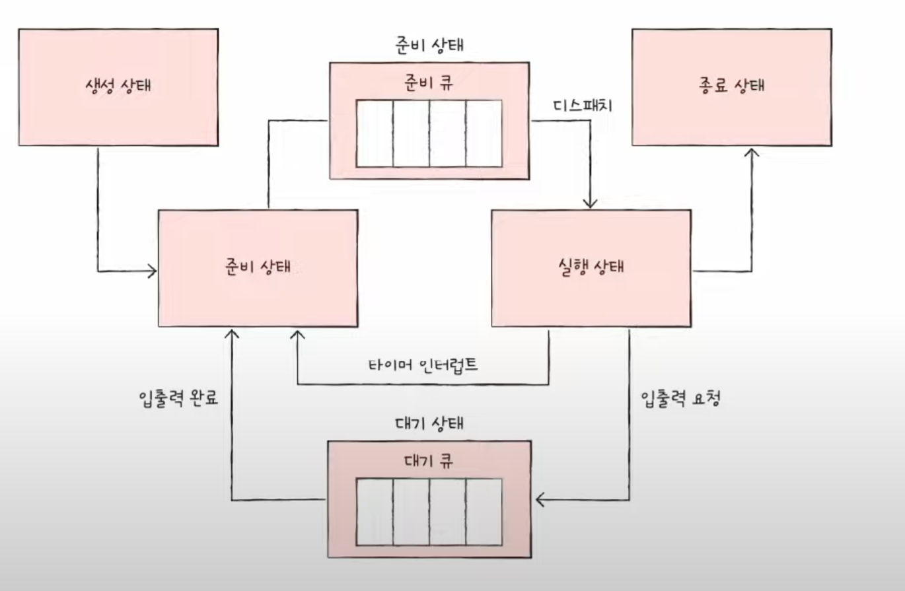
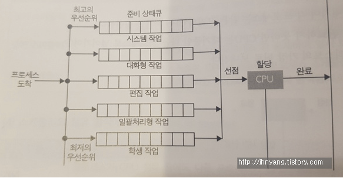

## CPU 스케줄링
#### 공부 날짜: 2024/06/27

  
### 키워드
- CPU 스케줄링
- 준비큐/대기큐
- 선점형스케줄링/비선점형스케줄링
- 

 

### CPU 스케줄링?
> 운영체제가 프로세스들에게 공정하고 합리적으로 **CPU 자원을 배분**하는 것. 

---

  

PCB에 우선순위(빨리 처리해야하는 프로세스 순위)가 적혀있지만, CPU를 사용할 다음 프로세스를 찾기 위해 운영체제가 일일히 모든 PCB를 뒤지는건 비효율적이다.... 

CPU 자원뿐 아니라 메모리에 적재되길 원하는 프로세스,, 입출력 장치와 보조기억장치를 원하는 프로세스 등등이 있을텐데 운영체제는 어떻게 다 PCB를 검사해서 자원을 할당할까? 

 

### 스케줄링 큐 
> 운영체제에서 프로세스나 작업 관리를 위해 사용되는 **자료 구조**

 
준비 큐: CPU를 사용하고 싶은 프로세스들이 들어있다.

대기 큐: 입출력 장치를 이용하기 위해 **대기 상태**에 접어든 프로세스들이 들어있다. 

 

### 선점형/비선점형 스케줄링 
1. 선점형 스케줄링은 프로세스가 CPU를 비롯한 자원을 사용하고 있더라도 OS가 프로세스로부터 **자원을 강제로 뺏어** 다른 프로세스에 할당할 수 있는 **스케줄링 방식**이다.
-> 즉 OS가 자원의 사용권을 **선점**한 것. 

2. 비선점형 스케줄링은 하나의 프로세스가 자원을 사용중일 때, 그 프로세스가 종료되거나 스스로 대기상태에 접어들기 전까진 **다른 프로세스가 끼어들 수 없는** 스케줄링 방식이다.
-> 즉 프로세스 종료,I/O 등의 이벤트가 있을 때까지 프로세스 실행을 보장하는 것. 

 

🤔 선점형 스케줄링과 비선점형 스케줄링의 장/단점?
1. 선점형 스케줄링은 **자원 독점을 막고** 프로세스들에게 자원을 골고루 할당이 가능하지만, **문맥 교환 과정에서 오버헤드가 발생할 수 있다.** 또한 처리 시간 예측이 어려움.

2. 비선점형 스케줄링은 문맥교환 횟수가 전자보다 적어서 오버헤드는 더 적고 프로세스 수행 시간이 예측 가능하다. 하지만 당장 자원을 필요로 하는 프로세스가 있어도 무작정 기다려야 하는 단점이 있고 모든 프로세스가 골고루 자원을 사용하지 못할 수 있다는 단점이 있다. 

---

 

각 스케줄링의 알고리즘에 쓰인 **아이디어**와 **작동 방식** , **장단점** 이해하기 

### CPU 스케줄링 알고리즘 
1. (비선점형) 선입 선처리 스케줄링(First Come First Served Scheduling): CPU를 먼저 요청한 프로세스가 CPU를 먼저 할당받는다. 

-> 호위 효과(Convoy Effect)가 발생한다. 즉 CPU 이용시간이 긴 프로세스들에 의해 CPU 이용시간이 짧은 프로세스들이 자원 사용을 위해 오래 기다려야하는 현상이다. 호위 현상이 발생할 경우 **CPU와 장치 이용률이 낮아진다.**

2. (비선점형 + 선점형) 최단 작업 우선 스케줄링(Shortest Job First Scheduling): 준비 큐에 삽입된 프로세스들 중 CPU 이용 시간 길이가 가장 짧은 프로세스부터 실행하는 스케줄링 방식. 

3. (선점형) 라운드 로빈 스케줄링(Round Robin Scheduling): **타임 슬라이스**라는 프로세스가 CPU를 사용할 수 있는 정해진 시간을 둬서 이 시간이 경과하면 프로세스로부터 CPU를 회수해 다른 프로세스에 CPU를 할당하는 방식이다. 

4. (비선점 + 선점형) 우선 순위 스케줄링(Priority): 준비큐에서 기다리는 프로세스들 중 우선순위가 가장 높은 프로세스에게 먼저 CPU를 할당하는 방식 

-> 우선순위가 높은 프로세스를 먼저 처리해서 우선순위가 낮은 프로세스는 실행이 계속 연기되는 **기아 현상**이 발생할 수 있다. 이를 해결하기 위해 오랫동안 대기한 프로세스의 우선순위를 점차 높이는 **에이징** 기법으로 방지할 수 있다. 

5. (선점형) 다단계 큐 스케줄링(Multilevel Queue Scheduling): 우선순위 스케줄링이 라운드 로빈과 결합한 스케줄링 알고리즘 

-> 성격이 다른 프로세스들을 별도의 준비 큐로 **분할해서 관리**한다. 각 큐는 각자의 스케줄링 알고리즘을 갖고 있다.

6. (선점형) 다단계 피드백 큐 스케줄링(Multilevel Feedback Queue Scheduling): 다단계 큐 스케줄링의 발전 형태. 다단계 큐 스케줄링의 프로세스들은 큐 사이 이동이 불가했다. 따라서 기아현상이 발생할 수 있는데 이를 보완한 알고리즘이다.즉 어떤 프로세스의 CPU이용 시간이 너무 길면 낮은 우선 순위큐로 이동시키고 어떤 프로세스가 낮은 우선순위큐에서 너무 오래 기다리면 높은 우선순위 큐로 이동시킨다. (에이징)

---

  

#### 참고 자료 
혼자 공부하는 컴퓨터 구조 운영체제

[자료1](https://github.com/devSquad-study/2023-CS-Study/blob/main/OS/os_cpu_scheduling_and_algorithm.md)

[자료2](https://gyoogle.dev/blog/computer-science/operating-system/CPU%20Scheduling.html)