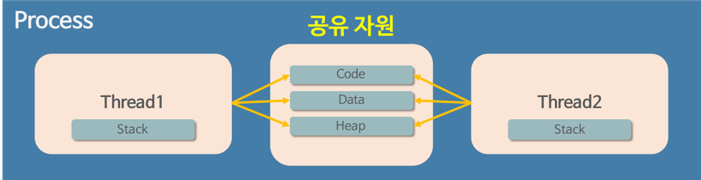

## 스레드
#### 공부 날짜: 2024/06/26

  
### 키워드
- 공유
- 독립적인 실행 흐름
- 스택 

 

### 스레드란
> 스레드란 프로세스를 구성하는 **독립적인 실행 흐름 단위**다. 하나의 프로세스는 여러 개의 스레드를 가질 수 있다. 

- 스레드도 하나의 실행 흐름이므로 실행과 관련된 데이터가 필요함.

- 각 스레드는 **자신만의 고유한** 스레드ID, 프로그램 카운터(PC),레지스터 집합,스택 영역을 가짐.
- 각 스레드는 속한 프로세스 내의 코드/데이터/힙 영역과 기타 운영체제 자원을 **다른 스레드와 공유**한다.
- 여러 개의 스레드가 있다면 **스레끼리 자원을 공유**하기 때문에 **동시 작업이 가능**하다. 

 

즉 stack 영역만 각 스레드가 할당 받고, 나머지 영역인 코드/데이터/힙 영역을 서로 공유한다. 

각 스레드는 stack 영역을 통해 **독립적인 실행 흐름**을 가짐. 

- 스레드는 **프로세스 메모리 영역**을 공유하기 때문에 어떤 스레드에서 오류가 발생하면 같은 프로세스 내 다른 스레드 모두가 강제 종료 된다. 

 

🤔왜 스레드는 stack 영역만 따로 할당받을까?

A. 스레드는 독립적인 동작을 수행하기 위해 존재한다. 그러면 독립적으로 함수를 호출할 수 있어야함.

때문에 함수의 매개변수나 지역변수등을 저장하는 스택 메모리 영역은 독립적으로 할당 받아야 한다. 

 

🔔 프로세스와 스레드의 차이

A. 프로세스는 각 프로세스마다 운영체제로부터 자신만의 고유 공간과 자원을 할당받아 사용한다. 하지만 스레드는 다른 스레드와 자원과 공간을 공유함. 

  

### 멀티 프로세스와 멀티 스레드 
1. 멀티 프로세스: **동시**에 여러 프로세스를 실행하는 것. 
2. 멀티 스레드: 하나의 프로세스 내에서 여러 스레드를 실행하는 것.

 

#### 차이점
1. 메모리 사용: 전자에서 각 프로세스는 독립적인 메모리 공간을 사용하지만 후자에서 각 스레드는 메모리 공간을 공유해서 사용한다.
2. 문맥 교환: 전자에서 프로세스간 문맥 교환은 무겁고 시간이 많이 소요되지만 스레드간 문맥 교환은 가볍고 비교적 빠르다.
3. 자원 소모: 전자가 더 많은 메모리와 CPU 자원을 소모한다. 
4. 안정성: 하나의 프로세스가 실패했을때 다른 프로세스에 영향을 끼치지 않지만, 하나의 스레드가 메모리를 오염시키면 다른 스레드에 영향을 끼칠 수 있다. 

 

🤔 멀티 스레드와 멀티 프로세스 사용 사례가 어떻게 될까? 

1. 멀티 프로세스 예: 웹 브라우저의 여러 탭,여러 창
2. 멀티 스레스 예: 웹 브라우저의 단일 탭 또는 창 내에서 브라우저 이벤트 루프,네트워크 처리,I/O 및 기타 작업 관리 및 처리 

  

#### 참고 자료
[인파 블로그](https://inpa.tistory.com/entry/%F0%9F%91%A9%E2%80%8D%F0%9F%92%BB-multi-process-multi-thread)

혼자 공부하는 컴퓨터구조 운영체제 