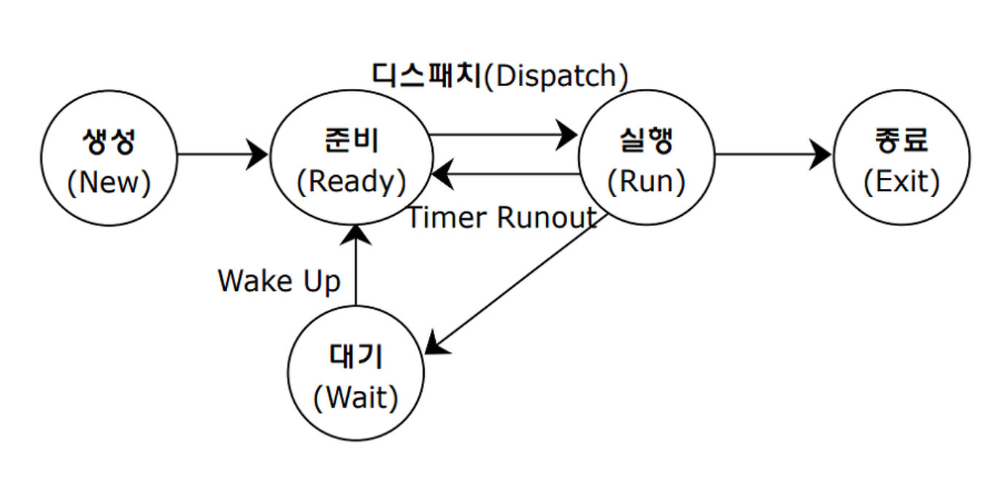

## 프로세스 
#### 공부 날짜: 2024/06/26

  
### 키워드
- 프로세스
- PCB(Process Control Block)
- 문맥 교환(Context switching)
- 프로세스 메모리 영역(힙,코드,데이터,스택)

 

### 프로세스
> 운영체제로부터 메모리 공간을 할당 받아 프로그램을 메모리 상에서 실행중인 작업 

 

### 프로세스 제어 블록(Process Control Block)
> 프로세스와 관련된 정보를 저장하는 자료구조. 해당 프로세스를 **식별**하기 위해 꼭 필요한 정보들이 저장되며, 프로세스 생성 시에 **커널 영역**에 만들어지고 실행이 끝나면 폐기된다. 

 

**PCB에 담기는 대표적인 정보**
1. PID(Process ID): 특정 **프로세스를 식별**하기 위해 부여하는 고유한 번호
2. 레지스터 값: 프로세스는 자신의 실행 차례가 돌아오면 이전 작업을 이어서 실행해야 함. 따라서 PCB 안에는 해당 프로세스가 실행되면서 **사용했던** 레지스터 값들이 담긴다. 
3. 프로세스 상태: 현재 프로세스가 CPU를 사용하기 위해 기다리는지, CPU를 이용하고 있는 상태인지 등 프로세스 상태 정보가 들어간다.
4. CPU 스케줄링 정보: 프로세스가 **언제,어떤순서로** CPU를 할당받을지에 대한 정보가 들어있다. 
5. 메모리 관리 정보: PCB에는 프로세스가 **어느 주소에 저장되어 있는지**에 대한 정보가 있어야 한다.따라서 베이스 레지스터,한계 레지스터 값들의 정보가 담긴다.
6. 사용한 파일과 입출력장치 목록: 프로세스 실행 과정에서 어떤 입출력장치가 이 프로세스에 할당되었는지, 어떤 파일을 열었는지에 대한 정보가 기록된다. 

 

### 문맥 교환 
하나의 프로세스 **수행을 재개**하기 위해 기억해야할 정보를 **문맥**이라고 한다. 즉 PCB에 기록되는 정보들이 문맥이라고 보면된다. 

> 기존 프로세스의 문맥을 PCB에 백업하고, 새로운 프로세스 실행을 위해 문맥을 PCB로부터 복구해서 새로운 프로세스를 실행하는 것을 **문맥 교환**이라고 한다.

 

🤔문맥교환을 자주하면 좋을까?

A. 문맥교환을 너무 자주하면 **오버헤드**가 발생할 수 있다. 여기서 오버헤드란 시스템의 주요 작업을 수행하는데 필요한 추가적인 시간과 자원 소모를 의미한다. 

 

### 프로세스의 메모리 영역 
프로세스가 생성되면 커널영역에 PCB가 생성된다. 그러면 메모리의 사용자 영역(user space)에 프로세스는 어떻게 배치될까?

하나의 프로세스는 사용자 영역에 크게 다음과 같이 나뉨 
1. 코드(Code) 영역: 프로세스가 **실행할 코드**가 기계어의 형태로 저장된 공간(= CPU가 실행할 명령어), **읽기 전용 영역**이다. 
2. 데이터(Data) 영역: **전역변수,static 변수,배열** 등이 저장된 공간
3. 힙(Heap) 영역: **프로그래머가 직접 할당할 수 있는(관리할 수 있는) 저장 공간** = 동적 할당이라고 한다. 
4. 스택(Stack) 영역: 데이터를 **일시적으로 저장**하는 공간. 

 

### 프로세스 상태 
프로세스의 상태를 표현하는 방식은 운영체제마다 조금씩 차이가 있지만, 프로세스가 가질 수 있는 대표적인 상태는 다음과 같다

1. 생성 상태: 프로세스를 생성 중인 상태, 이제 막 메모리에 적재되어 PCB를 할당받은 상태
2. 준비 상태: CPU 할당을 기다리는 상태. 모든 자원이 준비된 상태이며, 단지 CPU만 할당받으면 프로세스 실행이 가능하다. 
3. 실행 상태: CPU를 할당받아 실행 중인 상태. 실행 상태인 프로세스는 할당된 일정 시간동안만 CPU 사용이 가능하다.

준비 상태 -> 실행 상태로 전환 되는 것을 **디스패치**라고 함.

4. 대기 상태: CPU 이외의 자원이나 이벤트를 기다리는 상태
5. 종료 상태: 프로세스가 종료된 상태. 운영체제는 PCB와 프로세스가 사용한 메모리를 정리한다. 

