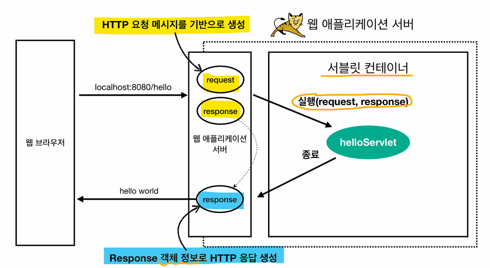

## 서블릿(Servlet)
#### 공부 날짜: 2024/07/04

  
### 키워드
- 웹 서버
- 웹 어플리케이션 서버
- 서블릿 
- 서블릿 컨테이너
- 서블릿 객체 
- 쓰레드 
- 쓰레드 풀 

 

---

### 사전 지식

- 웹 서버(Web Server)란? 
  - <u>HTTP를 기반</u>으로 동작하는 서버 
  - **정적 리소스**를 제공한다. 
  - 여기서 정적 리소스란 HTML,CSS,JS,이미지 영상 등을 의미한다. 
  - NGINX, APACHE가 웹 서버에 해당한다. 

 

- 웹 어플리케이션 서버란?(Web Application Server)
  - 마찬가지로 HTTP를 기반으로 동작하는 서버다. 
  - 웹 서버 기능을 포함한다. 
  - **프로그램 코드를 실행**해서 <u>**어플리케이션 로직을 수행**</u>할 수 있다. 
  - Tomcat,Jetty,Undertow가 웹 어플리케이션 서버에 해당한다. 

 

(웹 서버에서 플러그인을 설치하거나 해서 프로그램 코드를 실행할 수도 있긴함)

➡️ 정적 리소스가 많이 사용되면 web server 증설하면 되고 애플리케이션 리소스가 많이 사용되면 web application server(WAS)를 증설하면 된다. 

 

---

### 서블릿(Servlet)

서버에서 해야하는 업무들.... 너무 많다 전세계 개발자가 '비즈니스 로직을 제외하면' 똑같은 부분을 개발할텐데.. 너무 비효율적이지 않나❓
- 서버 TCP/IP 연결 대기, 소켓 연결
- HTTP 요청 메시지를 파싱해서 읽기
- POST 방식인지 GET URL 파라미터로 데이터를 전송했는지 
- Content-Type 확인 
- HTTP Message Body 내용 파싱 
- 비즈니스 로직 실행 
- 데이터 베이스에 저장 요청 
- HTTP 응답 메시지 생성 시작
- TCP/IP에 응답 전달 , 소켓 종료

 

이런 비효율적인 부분을 해결하기 위해 서블릿이 나왔다. 서블릿은 비즈니스 로직을 제외한 모든일을 다 **지원**해준다. 

> 웹 서버 내에서 실행되는 <u>작은 자바 프로그램</u>으로, 보통 **HTTP를 통해 웹 클라이언트로부터 요청을 받고 응답**한다. 
>
> 서블릿으로 개발자는 HTTP 스펙을 매우 편리하게 사용 가능하다. 

  

#### 웹 브라우저에서 /hello로 요청을 했을때 무슨일이 일어나나? 

1. 웹 클라이언트가 /hello로 HTTP 요청을 보낸다. 
2. **Web Application Server**가 요청 메시지를 기반으로 **Request,Response** <u>객체를 생성한다.</u>
3. **WAS**는 서블릿 컨테이너가 생성한 Servlet 객체를 **호출**한다.
   - 정확히 말하면 Servlet 객체의 service 메서드를 실행하는 것.
   - service 메서드의 매개변수로 WAS가 생성한 request,response 객체가 **전달**된다. 
4. 개발자는 Request,Response 객체에서 HTTP 요청 정보와,응답 정보를 편리하게 쓸 수 있다. 
5. **WAS**는 Response 객체에 담겨있는 내용으로 <u>HTTP 응답 정보를 생성한다.</u>

 

---

### 서블릿 컨테이너(Servlet Container)

> **servlet을 지원하는 WAS** 안에는 **서블릿 컨테이너**가 있다.
> 
> 서블릿 컨테이너가 **자동으로** 서블릿 객체를 **생성,관리,호출**해준다. (생명주기 관리)
> 
> Tomcat 처럼 **서블릿을 지원하는 WAS**를 서블릿 컨테이너라고 한다. 

 

- 서블릿 컨테이너는 <u>서블릿 객체를</u> 생성,관리,호출,종료하는 생명주기를 관리한다. 
- 서블릿 객체는 **싱글톤으로 관리**한다. 
- 동시 요청을 위해 **멀티쓰레드 처리를 지원**한다. 

---

서블릿 객체를 생성하고 관리하는건 서블릿 컨테이너다. 

그러나 <u>서블릿 객체를 호출하는 것은</u> 실제로는 **서블릿 컨테이너에서 <u>생성</u>한 쓰레드**다. 

### 쓰레드(Thread)

- 쓰레드는 프로그램 안에서 어플리케이션 코드를 하나하나 순차적으로 실행한다. 
- 쓰레드가 없다면 자바 어플리케이션 실행 자체가 불가능 ‼️
- 쓰레드는 **한 번에 하나의 코드 라인만** 수행한다.
- <u>동시 처리가 필요하면</u> 쓰레드를 **추가로 생성**해야 한다. 
  - 추가) 프로세스는 프로그램을 실행하는 것이고, 쓰레드는 하나의 프로세스를 구성하는 **독립적인 실행 흐름 단위**다. 하나의 프로세스는 여러개의 스레드를 가질 수 있다. 

 

🤔 클라이언트 요청마다 쓰레드를 생성했을때 장/단점? 

1. 장점
   - 동시 요청이 가능하다. 
   - 리소스(CPU,메모리)가 허용할 때 까지 요청 처리 가능하다. 
   - 하나의 쓰레드가 지연되어도, 나머지 쓰레드는 정상 작동한다. 
2. 단점 
   - 쓰레드 생성 비용이 비싸다.
   - 요청이 올 때마다 쓰레드를 생성할 시 , 응답 속도가 늦어진다. 
   - 쓰레드는 컨텍스트 스위칭(문맥교환) 비용이 발생한다. (CPU 코어수만큼 동시수행이 가능한데, 그 이상은 쓰레드를 서로 전환해야 한다.)
   - 쓰레드 생성에 제한이 없다. 따라서 고객 요청이 너무 많이 오면 CPU,메모리 임계점을 넘어 서버가 죽을 수 있다. 

 

이러한 단점을 해결하기 위해 **WAS**에서는 **Thread Pool**을 쓴다. 

 

---

### 쓰레드 풀(Thread Pool)
> 풀 안에 쓰레드를 **미리 생성해 놓은 것** (Tomcat은 최대 200개가 기본 설정이다.)
> 
> 쓰레드를 다 쓰면 죽이는게 아니라, 쓰레드를 풀에 반환한다. 

 

❓쓰레드 풀에 있는 쓰레드가 모두 사용중인데 클라이언트 요청이 온다면? 

A. 그 요청은 거절하거나 특정 숫자만큼만 대기할 수 있게 설정할 수 있다. 

 

- 쓰레드가 미리 생성되어 있으므로, 쓰레드를 생성하고 종료하는 비용(CPU)이 절약되고 , 응답 시간이 빠르다. 
- 생성 가능한 쓰레드 최대치가 있어서 너무 많은 요청이 들어와도 **기존 요청은 안전하게 처리할 수 있다.** -> 서버가 안죽는다는게 아님!! 

  

---

#### 참고 자료
[인프런 강의](https://www.inflearn.com/course/%EC%8A%A4%ED%94%84%EB%A7%81-mvc-1/dashboard)